## CSP-J 大纲

依据《NOI 系列竞赛大纲 2025 修订版》整理，**只包含 J 组必考内容，不含 S 组进阶**，分五大模块：C++ 基础语法、基础数据结构、STL 容器、全部算法模块、初赛计算机基础。标注★为复赛高频必考。

### 前置：C++ 程序设计基础（所有数据结构 / 算法的载体）

 1. 基础语法

2. 数据类型：`int/long long/char/bool/double`，取值范围、溢出问题
3. 运算符：算术、逻辑、关系、**位运算 (& | ^ <<>>)**、运算符优先级
4. 输入输出：`cin/cout`、`scanf/printf`、加速读写
5. 分支：`if-else`、`switch`
6. 循环：`for/while/do while`，循环边界、死循环排查
7. 常量、变量、作用域：全局变量默认 0、局部栈随机垃圾值、`static` 局部变量特性
8. 数组：一维、二维、全局开大数组（局部栈限制）、桶数组计数
9. 字符串：`char[]`、`string` 类、字符串基础操作、子串、拼接、字符查找
10. 函数：形参实参、值传递 / 引用传递、返回值、函数重载
11. 递归函数：递归思想、递归终止条件、递归栈深度限制
12. 结构体 `struct`：自定义存储单元、结构体数组、结构体排序
13. 指针与引用基础：数组指针、结构体指针（看懂即可，不要求手写复杂链表）
14. 文件读写（初赛阅读程序、调试会涉及）

 15. 内存核心考点（初赛必考）

- 全局变量：存堆，自动清零，可开 1 e 5/1 e 6 大数组
- 局部变量：存栈，空间极小，不能开大数组，无自动初始化
### CSP-J 全部数据结构大纲（核心模块）

### 模块 1：线性数据结构（★全部必考）

1. 数组

- 静态数组、二维数组、桶排序计数数组
- 前缀和、差分（属于数组衍生算法，必考）

 2. 链表

- 手写单链表（链式前向星本质就是单链表）
- 双向链表基础概念（初赛选择会考）
- 循环链表简单认知

 3. 栈 Stack（LIFO 后进先出）

4. 手写数组栈、STL `stack`
5. 经典应用：
   
    - 括号匹配、表达式求值（中缀转后缀）
    - DFS 递归模拟、出栈序列计数（初赛选择题高频）
    
6. 队列 Queue（FIFO 先进先出）

7. 普通队列、STL `queue`
8. 应用：BFS 广度优先搜索、层次遍历

9. 双端队列 deque（了解基础操作）

 10. 优先队列（堆）priority_queue ★复赛高频

- 大根堆、小根堆定义与使用
- 应用：贪心、哈夫曼树、区间最值

### 模块 2：树结构（初赛选择 + 复赛代码必考）

 1. 基础树概念

根、叶子、深度、高度、子树、节点度数

 2. 二叉树 ★重中之重

           二叉树基础性质（节点数量、层数、叶子数计算，初赛计算题）
           三种遍历：前序 (根左右)、中序 (左根右)、后序 (左右根)
          由两种遍历序列还原二叉树（初赛完善程序）

3. 完全二叉树

- 数组顺序存储，父子下标关系（`2x` 左孩子、`2x+1` 右孩子）

 4. 二叉搜索树 BST

性质：左 < 根 < 右、查找、插入、删除基础逻辑

 5. 哈夫曼树（霍夫曼树）★初赛必考

- 构造规则、WPL 带权路径长度计算、哈夫曼编码

 6. 普通多叉树（无根树 / 有根树）

- 链式前向星存储、树上 DFS 遍历、子树统计

### 模块 3：图结构（复赛必考四道题必有一道图 / 树）

1. 图基础概念：顶点、边、有向图 / 无向图、边权、入度出度、连通块
2. 两种存储方式：
   
    - 邻接矩阵（小点数据）
    - **链式前向星（邻接表）★核心，你正在学的模板**
    
3. 图遍历：DFS 深度优先、BFS 广度优先
4. 简单应用：连通块计数、迷宫最短路、拓扑排序（基础）

### 模块 4、STL 标准容器（复赛提速必备）

1. `vector` 动态数组：`push_back`、遍历、排序、动态扩容
2. `stack` / `queue` / `priority_queue`
3. `string`：`substr`、`find`、`erase`、`length`
4. `map` / `set`（基础去重、离散化、键值查找）
5. 通用函数：`sort`、`min/max`、`swap`、`unique` 去重

### 模块 5、并查集（简单集合结构，J 组上限）

- `fa[]` 父节点数组、查找 `find`、合并 `union`、路径压缩
- 应用：无向图连通块、集合合并

> 注：树状数组、线段树、字典树属于 CSP-S，J 组不考
## 数据结构

### 数据结构初识
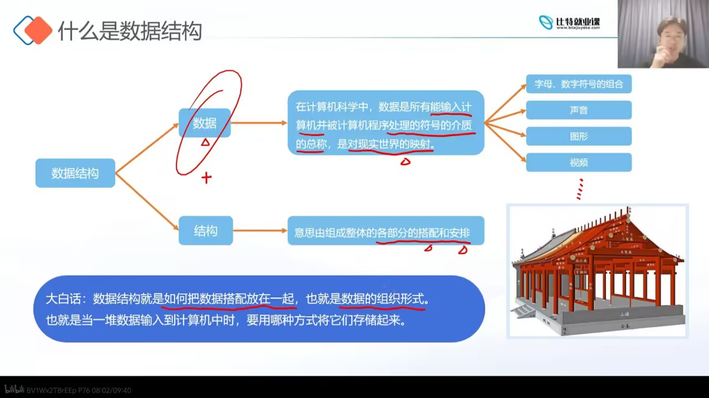
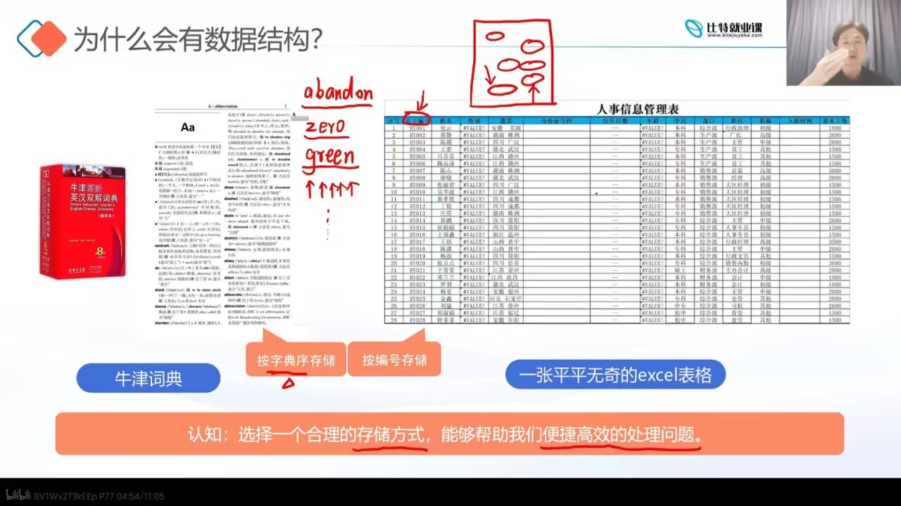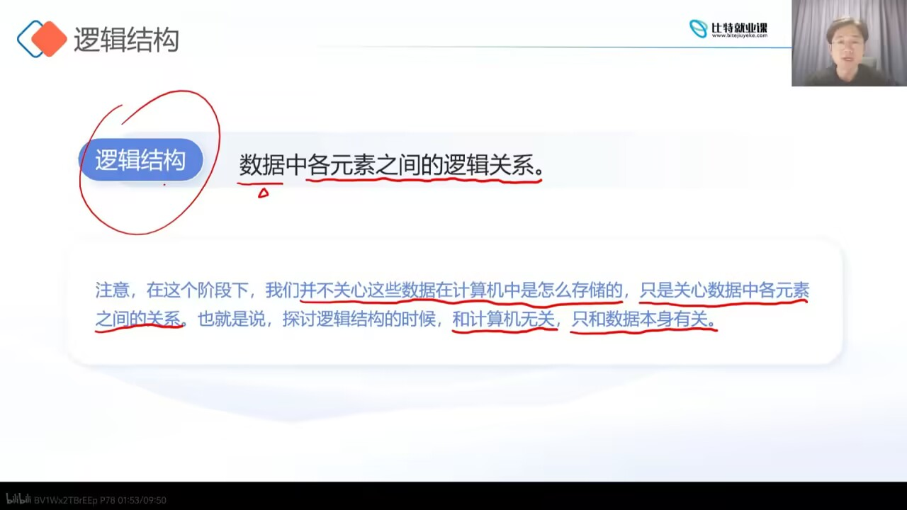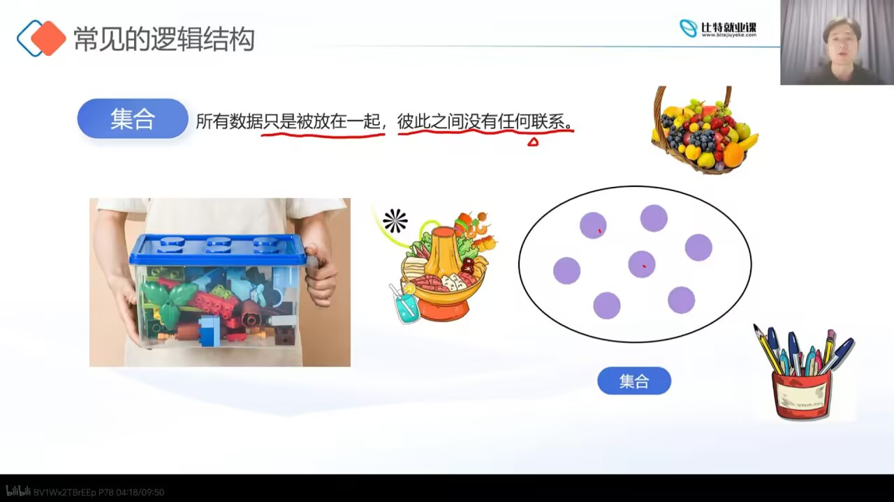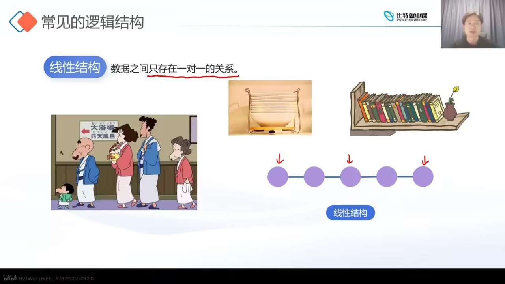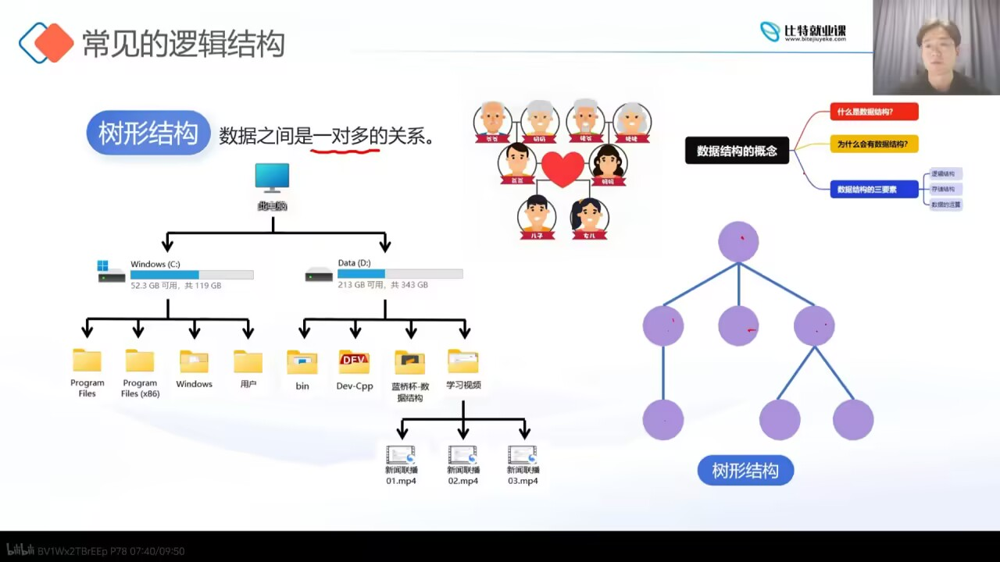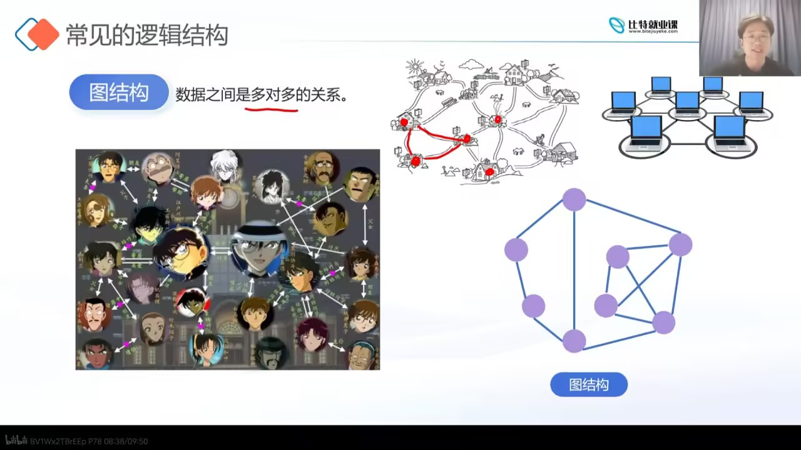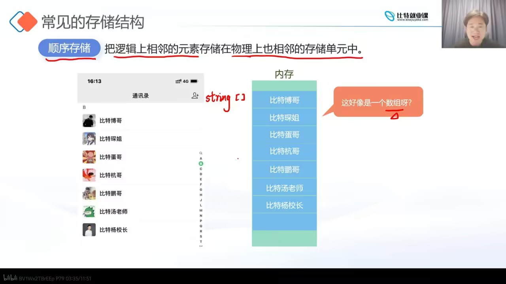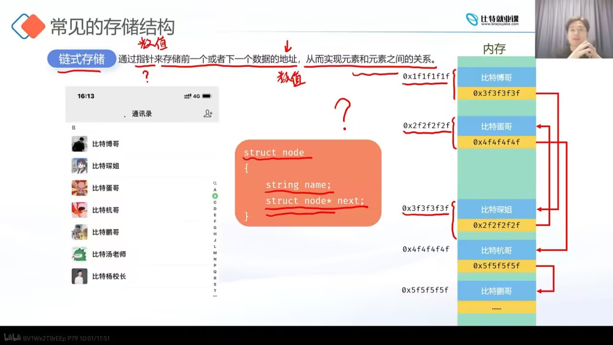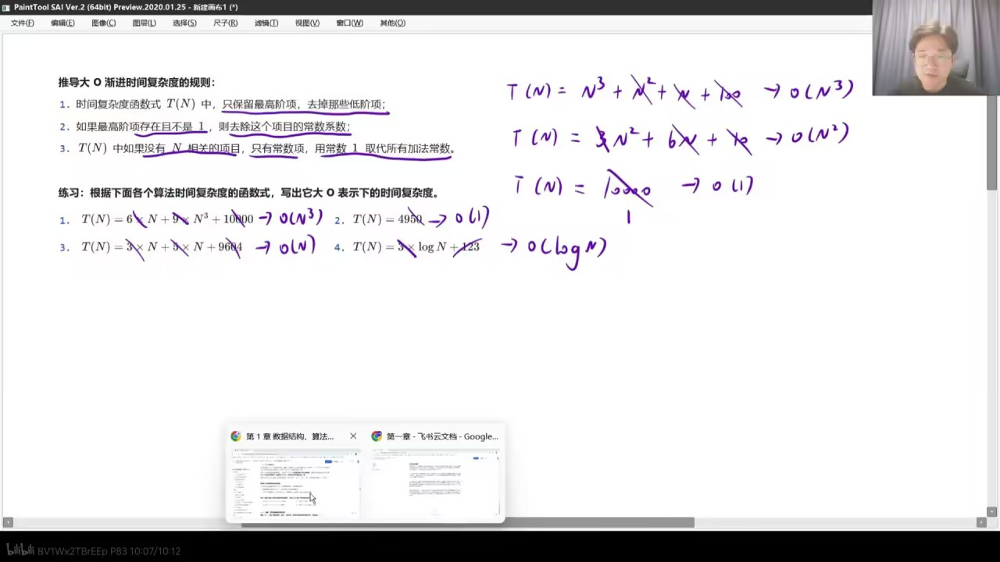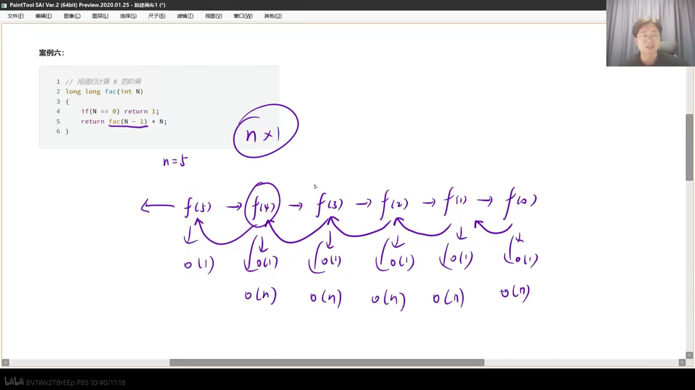
### 顺序表
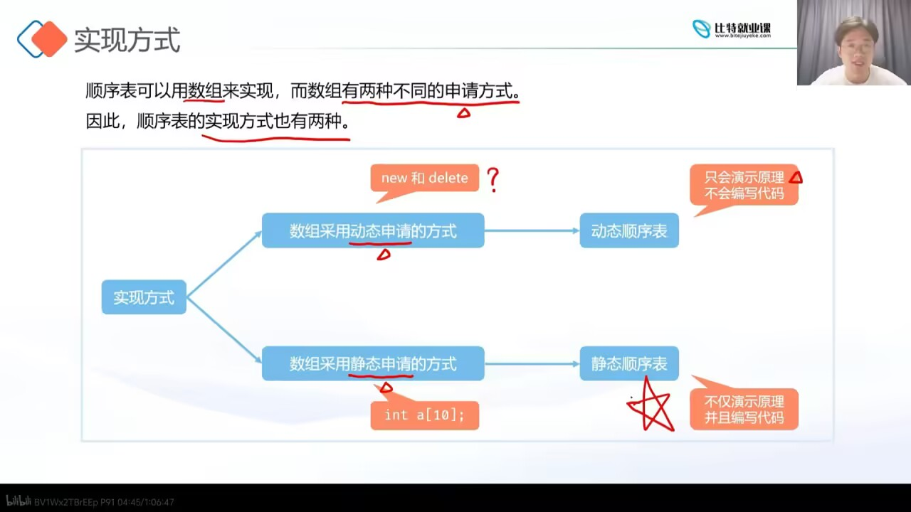
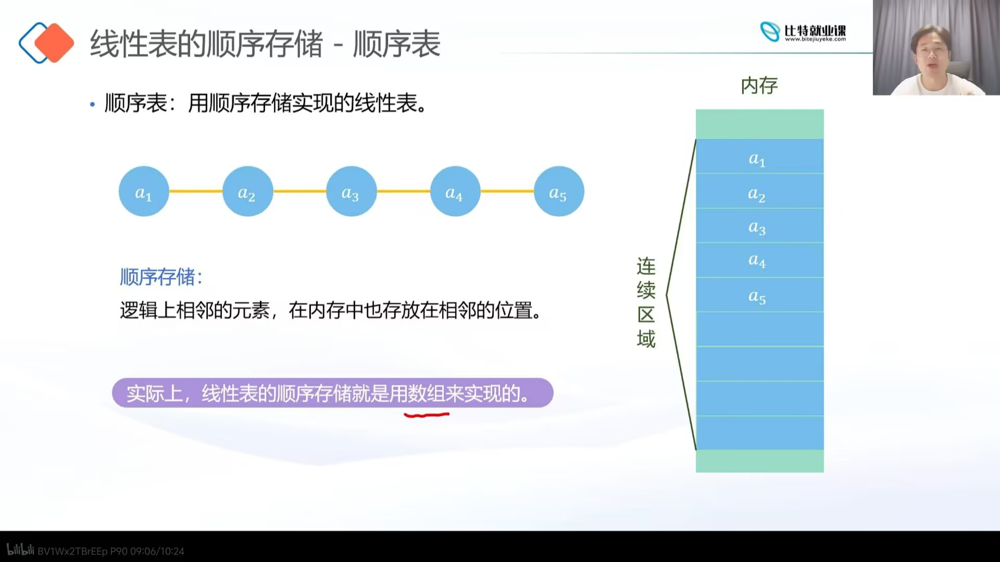
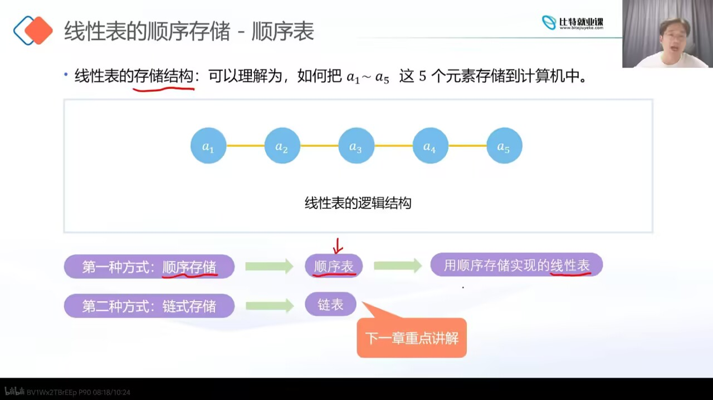
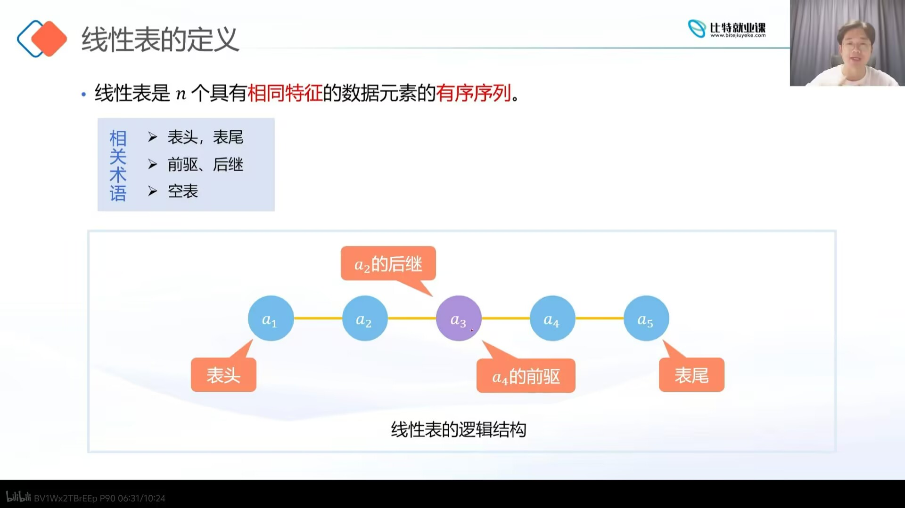

### 动态顺序表创建
还记得我们写结构体时开辟的 `length`（当前人数）和 `capacity`（最大格子数）吗？`vector` 简直是一对一完美复刻了这两个账本：

- ** `v.size()` **：等价于 `length`。告诉你目前顺序表里**真正存了几个有效元素**。
  
- ** `v.capacity()` **：等价于 `capacity`。告诉你目前大本营在不用扩容的情况下，**最多能装多少个元素**。
```C++
#include <iostream>
#include <vector> // 💡 引入官方动态顺序表头文件

using namespace std;

// 💡 方便打印顺序表账本的辅助函数
void printVectorInfo(const vector<int>& v) {
    cout << "顺序表内容: [ ";
    for (int i = 0; i < v.size(); i++) {
        cout << v[i] << " "; // 💡 1. 【查】利用下标直接随机访问，时间复杂度 O(1)
    }
    cout << "]  (size=" << v.size() << ", capacity=" << v.capacity() << ")\n";
}

int main() {
    // 💡 2. 【初始化】声明一个空的动态顺序表
    vector<int> v; 
    cout << "--- 刚刚初始化 --- \n";
    printVectorInfo(v);

    // 💡 3. 【末尾插入】动态顺序表最喜欢的操作，时间复杂度平均 O(1)
    // 随着我们疯狂塞入数字，你可以仔细观察屏幕输出里 capacity（最大容量）的变化！
    cout << "\n--- 疯狂在末尾追加元素 --- \n";
    v.push_back(10); 
    v.push_back(20);
    v.push_back(30);
    v.push_back(40); // 塞满 4 个元素
    printVectorInfo(v);

    // 💡 4. 【定点插入】在下标为 1 的位置（即 20 的前面）强行插入一个 99
    // 物理底层：vector 会自动把 20, 30, 40 齐刷刷往后挪一格，然后把 99 填进去
    cout << "\n--- 在下标 1 处定点插入 99 --- \n";
    v.insert(v.begin() + 1, 99); 
    printVectorInfo(v); // 💡 震撼：你会发现容量自动翻倍或扩大了！

    // 💡 5. 【修改】把下标为 3 的元素改成 666
    cout << "\n--- 把下标 3 的元素修改为 666 --- \n";
    v[3] = 666; 
    printVectorInfo(v);

    // 💡 6. 【定点删除】把下标为 2 的元素无情抹去
    // 物理底层：vector 会自动把后面的元素齐刷刷往前挪一格，把漏洞补上
    cout << "\n--- 删除下标 2 处的元素 --- \n";
    v.erase(v.begin() + 2); 
    printVectorInfo(v);

    // 💡 7. 【末尾删除】
    cout << "\n--- 弹出末尾最后一个元素 --- \n";
    v.pop_back(); 
    printVectorInfo(v);

    return 0;
}
```

**深度解密：`vector` 在后台是怎么悄悄扩容的？**

如果你把上面那段代码运行一下，你会看到一个极其有趣的现象（以常见的 GCC 编译器为例）：

1. 刚刚声明 `vector<int> v;` 时：`size = 0, capacity = 0`。
   
2. 第一次 `push_back(10)` 时：大本营发现没地方住，向内存申请 1 个格子。`size = 1, capacity = 1`。
   
3. 第二次 `push_back(20)` 时：格子满了！触发扩容。容量翻倍变成 2。`size = 2, capacity = 2`。
   
4. 第三次 `push_back(30)` 时：格子又满了！触发扩容。容量再次翻倍变成 4。`size = 3, capacity = 4`。
   
5. 第四次 `push_back(40)` 时：刚好有空位，直接住进去。`size = 4, capacity = 4`。
   
6. **最震撼的一幕**：当你在满仓状态下，调用 `v.insert(..., 99)` 插入第 5 个元素时，`vector` 在后台瞬间无脑执行了我们上一节手写的那套逻辑——**向内存申请一个容量为 8（原先 4 的两倍）的新家，把老数据 10, 20, 30, 40 拷贝过去，顺便挪好格子塞入 99，然后把老家的内存悄悄删掉！** 于是输出变成了 `size = 5, capacity = 8`。
   

 **📝 考场与竞赛的 vector 避坑黄金法则**

虽然 `vector` 很好用，但作为动态顺序表，它有两个**物理死穴**，这也是改卷老师和算法竞赛最喜欢卡你的地方：

1. **定点插入删除是 $O(N)$ 的**：
   
    如果你用 `v.insert()` 或者 `v.erase()` 在顺序表的最前面（下标 0）频繁操作，由于每一次都要让后面 $N$ 个元素整体大漂移（挪位置），数据量一旦上 $10^5$ 就会彻底超时（TLE）。所以，**频繁在头部/中间增删的场景，请右转找链表；只有频繁在末尾增删、或者频繁随机查询的场景，才首选 vector。**
    
2. **预建基地大招（`reserve`）**：
   
    既然每次扩容都要“搬家”，那频繁搬家肯定会耽误时间。如果你在比赛里明确知道这道题一共要读入 $10^5$ 个数据，聪明的做法是在刚建好 `vector` 时，写一句：
    
    C++
    
    ```
    v.reserve(100005); // 提前让最大容量 capacity 变成 10 万
    ```
    
    这样，它一上来就拥有一栋高楼大厦，后续你疯狂 `push_back` 的时候就**一次搬家都不会触发**，运行速度会像开了挂一样快！


### 静态链表


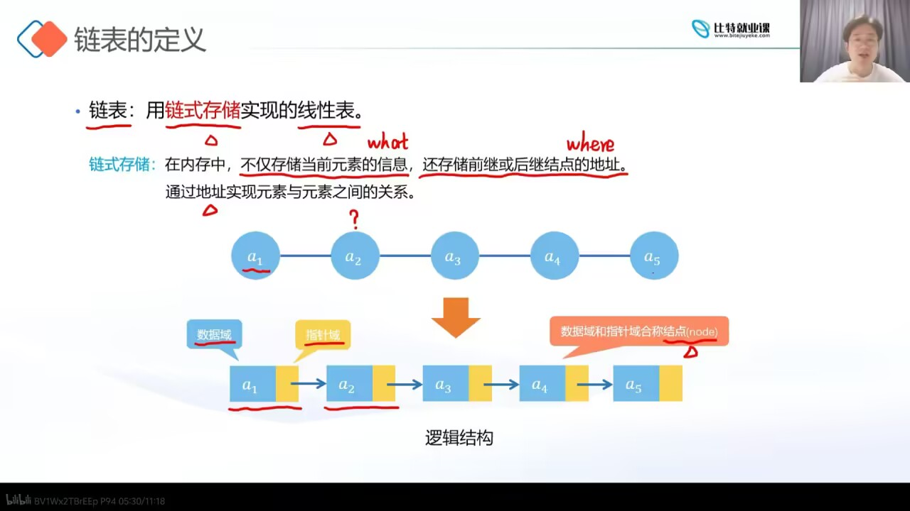
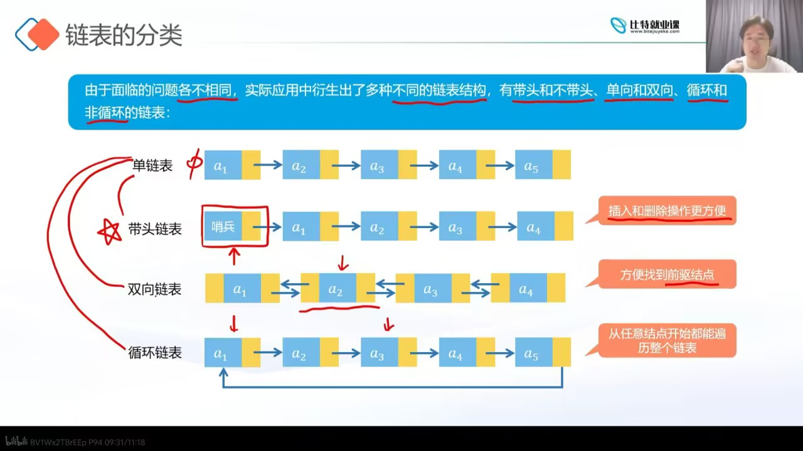
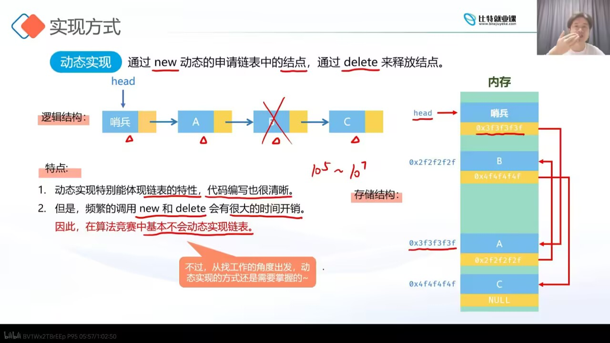
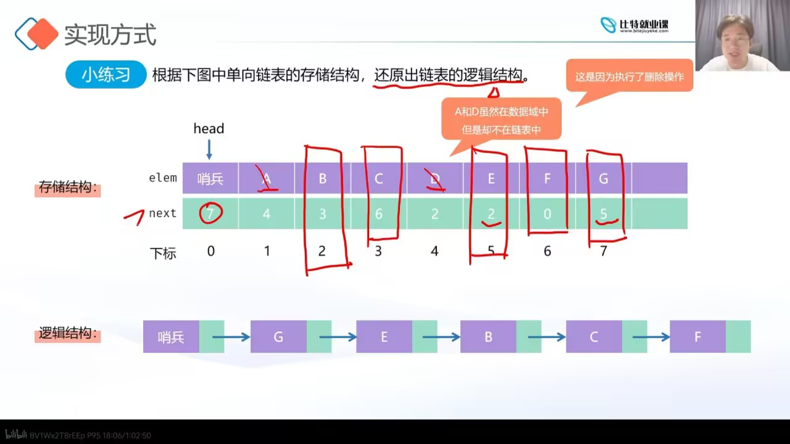
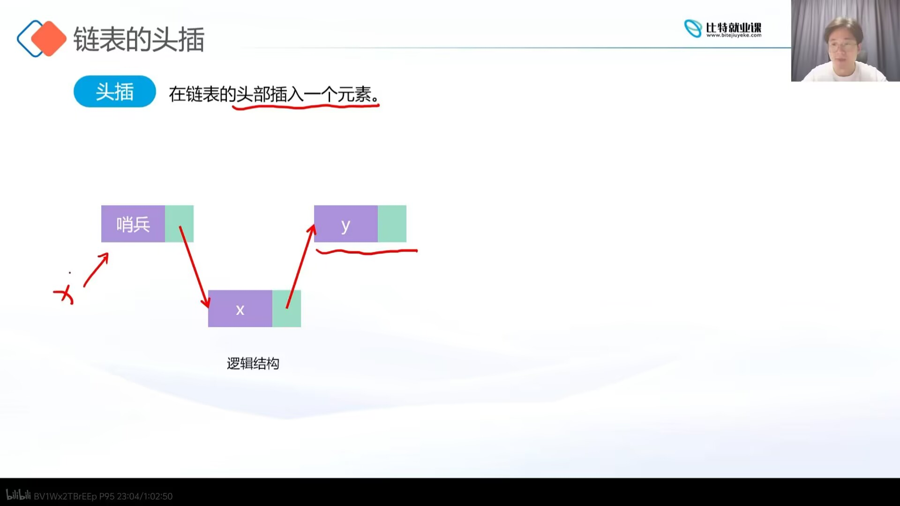
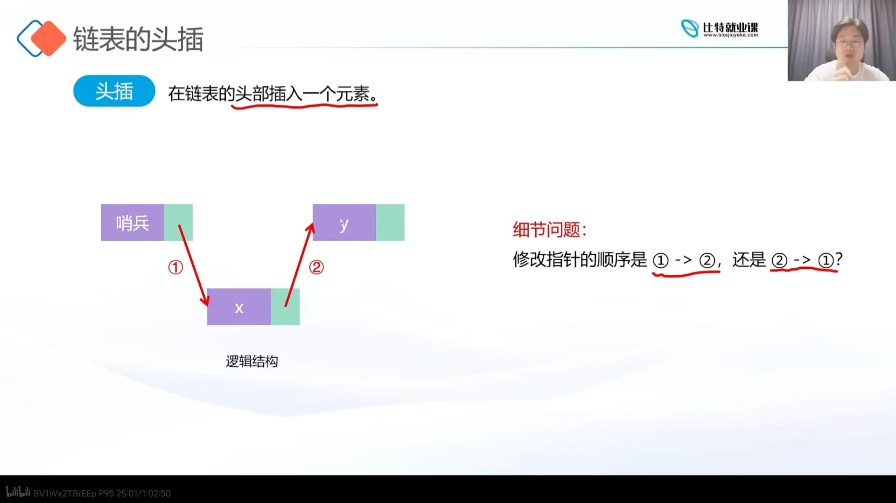
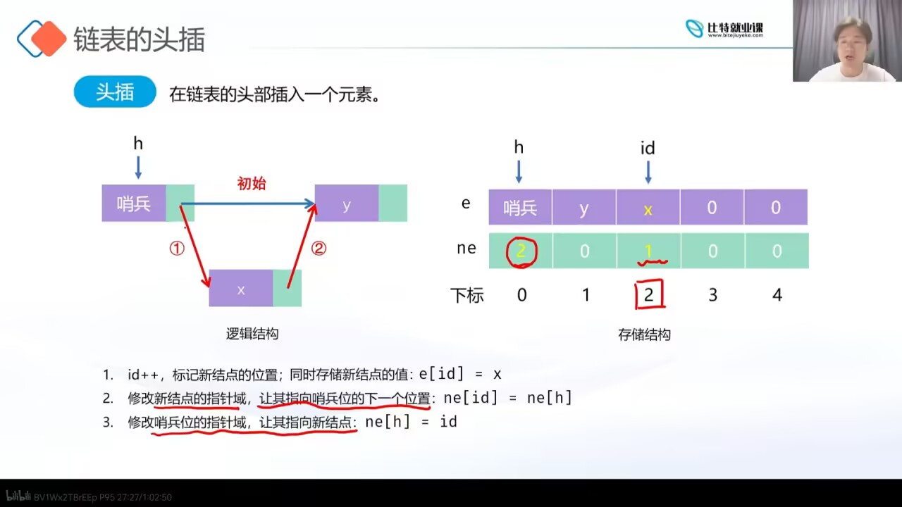
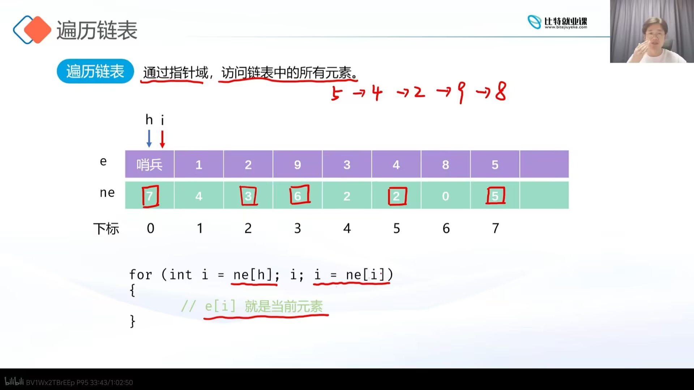
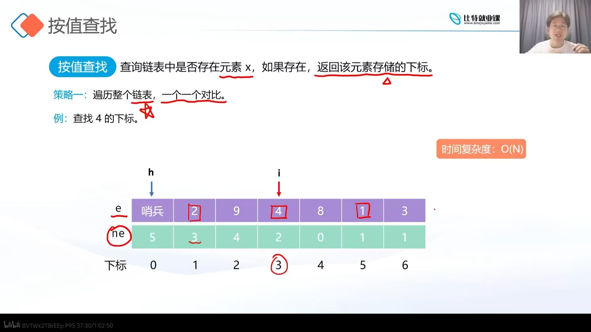
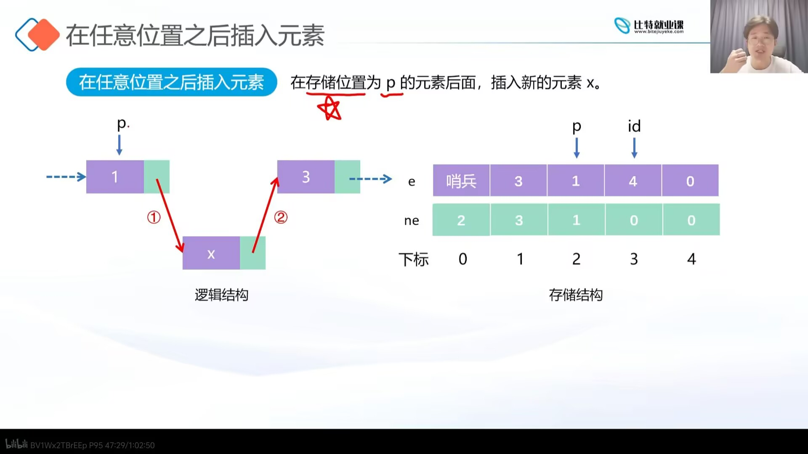

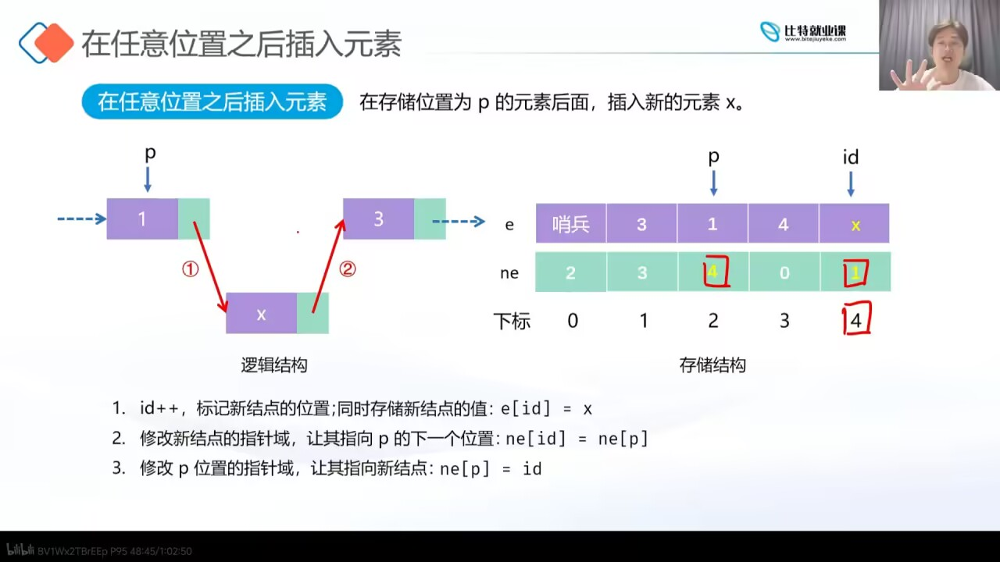
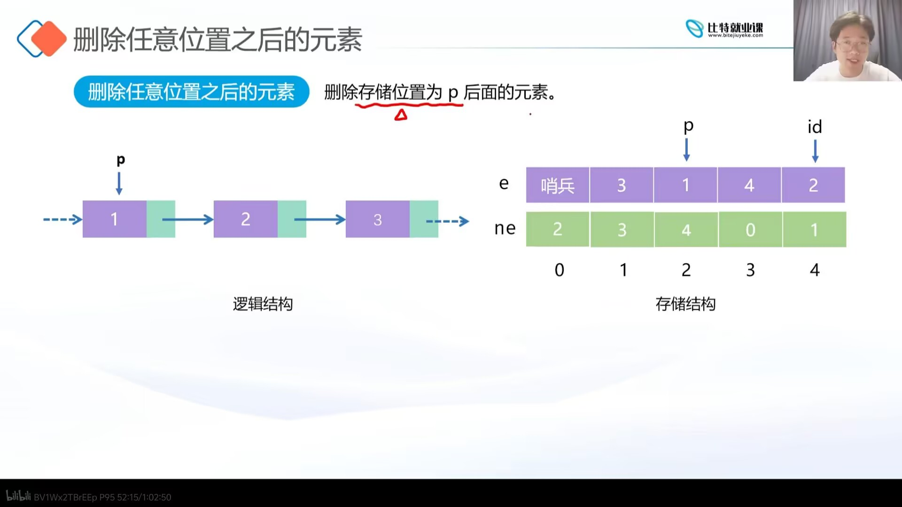
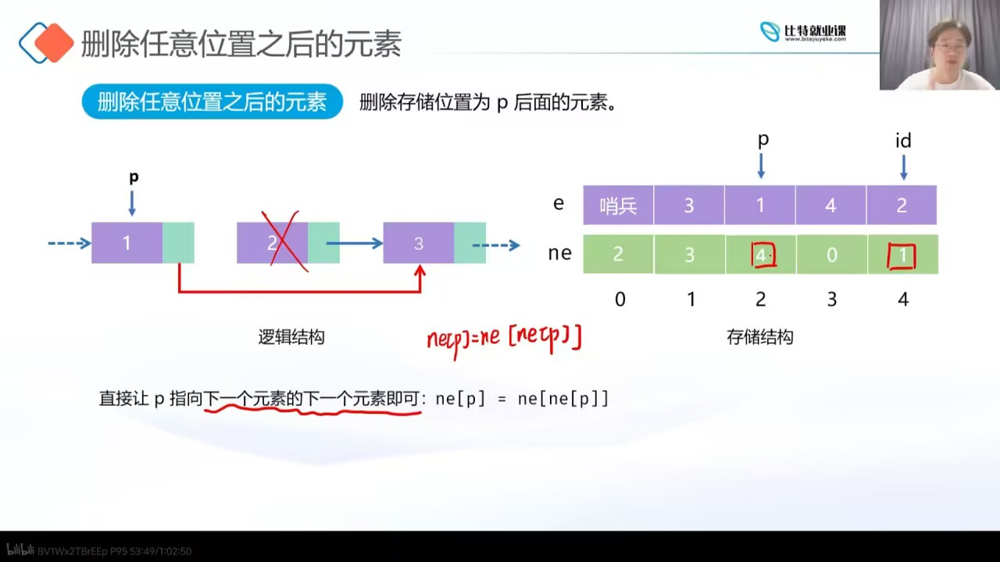
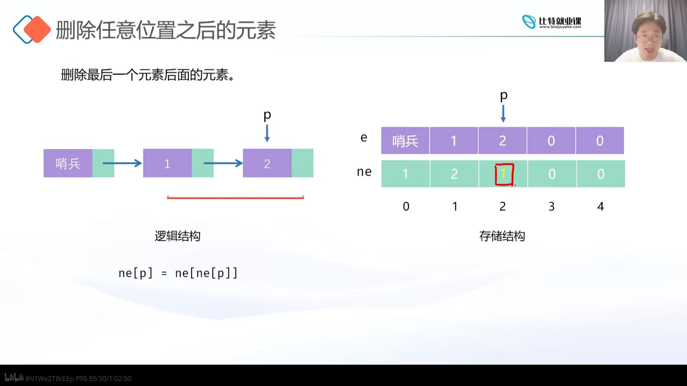
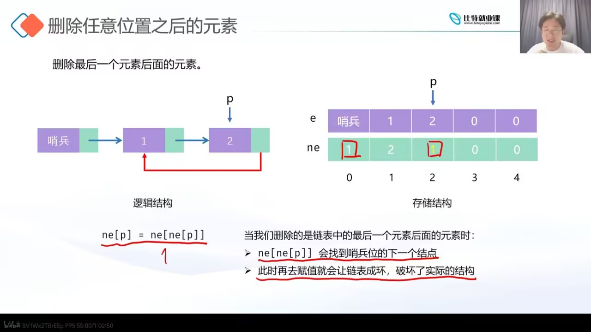
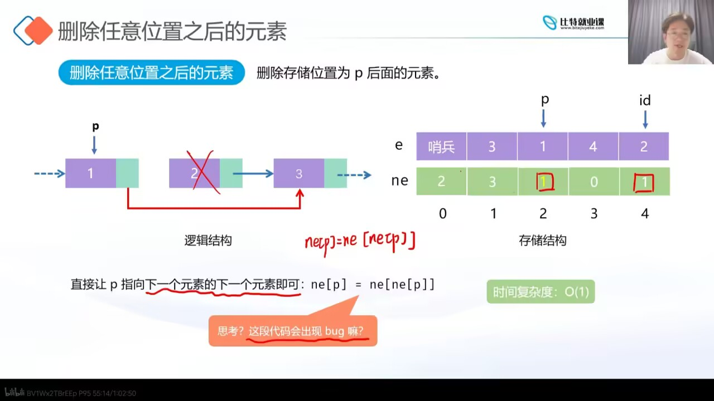
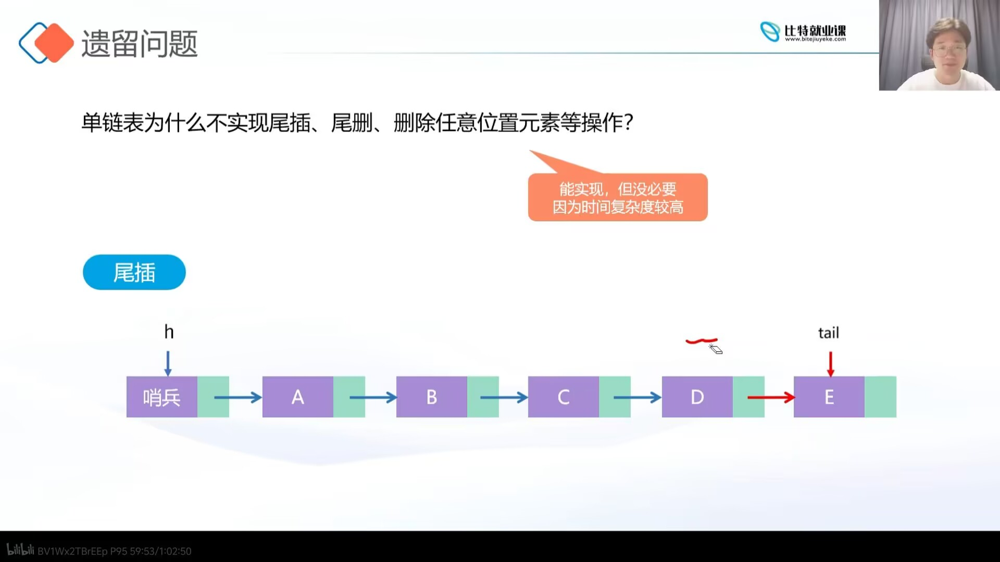
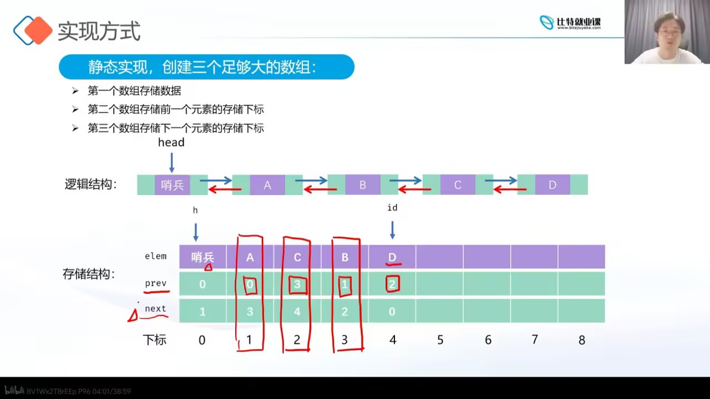

#### 代码实现
```C++
#include <iostream>
using namespace std;

#define MAXSIZE 100005
#define NOTFOUND -1 // 用 -1 代表空指针

// 💡 1. 声明节点结构体
struct StaticNode {
    int data;  // 存放具体数值（对应原 e[id]）
    int next;  // 存放下一个节点的数组下标（对应原 ne[id]）
};

// 💡 2. 声明大池子
StaticNode node_pool[MAXSIZE];
int id = 0; // 分配器计数：0 号固定给哨兵用，后面新节点从 1 开始

// 💡 3. 初始化函数：把 0 号哨兵位设置好
void init() {
    node_pool[0].next = NOTFOUND; // 刚开始链表是空的，0 号哨兵后面谁也没有
    id = 0;                       // 0 号被哨兵占了
}

// 💡 4. 完美融合你思路的头插函数
void push_front(int x)
{
    // 先把 x 放在一个新的格子里面（从 1 开始分配）
    id++;
    node_pool[id].data = x;
    
    // 修改指针，顺序同样绝对不能颠倒！
    // 1. 新格子的右指针，指向哨兵位原本拉着的后继节点
    node_pool[id].next = node_pool[0].next;
    
    // 2. 哨兵位的右指针，反手拉住这个新生的 id 节点
    node_pool[0].next = id;
}

// 💡 5. 配合哨兵位的标准遍历打印
void printList() {
    // 哨兵自己（0 号）不用打印，从 0 号指向的第一个真正的数据节点开始看
    int p = node_pool[0].next; 
    
    while (p != NOTFOUND) {
        cout << node_pool[p].data << " -> ";
        p = node_pool[p].next; // 探针向后移动
    }
    cout << "NULL\n";
}

int main() {
    init(); // 别忘了先初始化哨兵

    push_front(10);
    push_front(20);
    push_front(30);

    cout << "链表内容：";
    printList(); // 输出: 30 -> 20 -> 10 -> NULL

    return 0;
}
```
#### 代替链表的方式
手写静态链表（那一堆 `val` 和 `nxt` 数组）确实极其枯燥、反人类直觉，写起来就像在石器时代敲代码。而 `std::list` 又是出了名的“超时炸弹”。

既然你就是想在竞赛中优雅地用标准库，又不想碰最原始的手写数组，这里有 **两条既不违背你使用“高级工具”的意愿，又能逃过评测机超时卡死** 的黄金出路：

 **出路一：给 `std::list` 挂载“专属分配器”（完美自救法）**

`std::list` 慢的根本原因，是它每次插入节点都去向操作系统慢吞吞地要一块零散的内存（`std::allocator`）。

C++ 允许我们换掉这个默认的内存分配器。我们可以用官方提供的 **“内存池分配器” `std::pmr::list` **（C++17 标准）。它会预先在连续的物理内存里圈好一大块地（静态分配），后面 `list` 插入节点时直接从这块地里拿，速度和手写静态数组一样快！
当你写下普通代码：

C++

```
std::list<int> L;
L.push_back(10);
```

它的底层发生了一次残暴的操作系统调用：

1. `std::list` 拿着数据 `10` 敲响了操作系统的门：“报告，我要塞个新数，给我临时划拉一块内存！”
   
2. 操作系统满地找碎布头一样，在堆内存（Heap）里找了一块空地，登记一下，把地址给 `list`。
   
3. `list` 把这块地包成一个结构体节点，让它和前后的兄弟节点连起来。
   

如果题目有 $10^5$ 条操作，你的程序就要**反复敲门 10 万次**！这还没算频繁销毁节点时的 `delete`（释放内存）敲门声。操作系统光是应付你这个“内存批发商”就累死了，这就是你大面积 **TLE（超时）** 的真正罪魁祸首。
为了解决这个痛点，C++17 正式引入了 `pmr`（Polymorphic Memory Architecture，多态内存架构）。

它的核心逻辑非常简单：**“批发商”直接变“地产大亨”**。 既然零散申请慢，那我能不能在**程序刚启动、比赛还没开始的时候**，一巴掌向系统申请一块巨大的、连续的土地？后面我的 `list` 要塞新节点时，直接在这块地里圈一个格子用，再也不去敲操作系统的门了。这块地在专业上就叫 **“内存池（Memory Pool）”**。

 🛠️ 代码实现：

C++

```c
#include <iostream>
#include <list>
#include <memory_resource> // 💡 引入多态内存资源头文件

using namespace std;

// 预先开辟一块绝对够用的连续静态内存池（比如放 10 万个节点）
char buffer[100005 * 32]; 

int main() {
    // 1. 用静态大数组初始化一个内存池资源
    std::pmr::monotonic_buffer_resource pool(buffer, sizeof(buffer));

    // 2. 💡 声明一个挂载了该内存池的 list
    // 它的用法和普通的 std::list 没有任何区别，但底层分配快了 10 倍以上！
    std::pmr::list<int> my_list(&pool);

    // 接下来你可以疯狂使用高级库函数，绝对不会因为申请内存超时
    my_list.push_back(10);
    my_list.push_front(20);
    my_list.insert(my_list.begin(), 99);

    // 遍历依然很优雅
    for (int x : my_list) {
        cout << x << " -> ";
    }
    cout << "NULL\n";

    return 0;
}
```

- **为什么推荐**：你保住了 `list`、`push_front`、`insert` 和迭代器等所有高级语法，同时顺手解决了内存碎片的死穴。
  

 **出路二：降维打击，用 `std::vector` 代替链表**

如果这道题的链表只是用来频繁在中间、头部执行“插入”和“删除”，且总数据量在 ** $5 \times 10^4$ 以内**，不要犹豫，直接无脑用 `std::vector`。

你可能会想：`vector` 在头部插入不是 $O(N)$ 的吗？链表才是 $O(1)$ 呀！

- **现实很残酷**：在评测机里，由于 `vector` 内存极度连续，CPU 硬件对其有极其恐怖的缓存加速。
  
- **实测结果**：在 $5 \times 10^4$ 数据量内，`vector.insert()` 虽然理论上要挪动大量元素，但其**实际运行耗时往往比号称 $O(1)$ 的普通 `std::list` 还要快**！
  

 🛠️ 怎么用最爽：

C++

```
#include <iostream>
#include <vector>

using namespace std;

int main() {
    vector<int> v;
    v.reserve(50005); // 💡 赛前大招：一次性把高楼盖好，后续绝不反复扩容搬家

    // 像链表一样在头部、中间插入，在 5 万数据量以内跑得飞快
    v.insert(v.begin(), 10);
    v.insert(v.begin(), 20);
    v.insert(v.begin() + 1, 99); // 在中间插

    // 像链表一样删除
    v.erase(v.begin() + 1);

    for(int x : v) cout << x << " ";
    return 0;
}
```
**方式选择**

1. **数据量 $\le 5 \times 10^4$ **：不要写任何链表，直接用 `vector` 搭配 `reserve()`，用它的 `insert` 和 `erase` 去硬刚，库函数最全，写起来最舒服。
   
2. **数据量达 $10^5$ 级别，且必须要链表**：不要用普通 `list`，用 C++17 的 ** `std::pmr::list` ** 挂载静态内存池，既保留了高级容器的尊严，又能拿到满分。
   
3. **数据量达到 $5 \times 10^5$ 以上**：这时候标准库的容器套外挂也有些吃力了，只能乖乖写静态数组模拟。

### 栈与队列
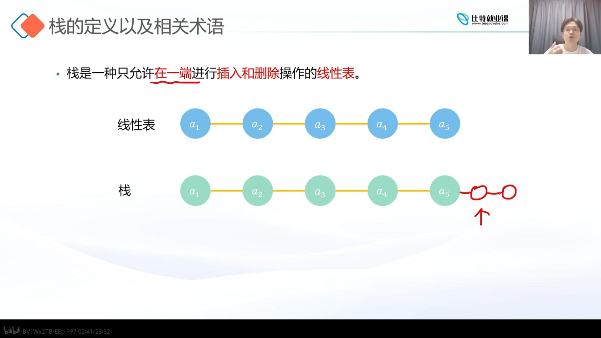
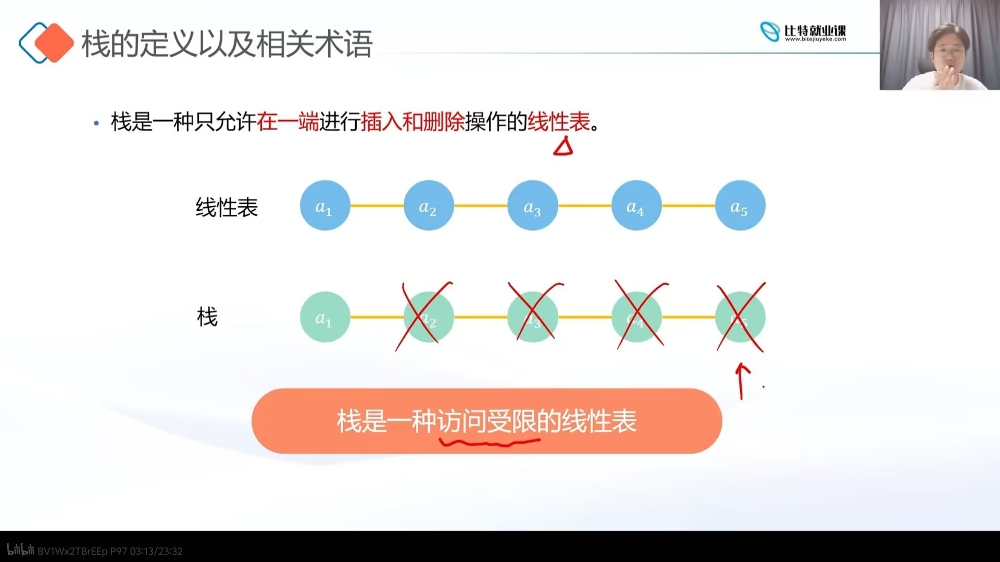


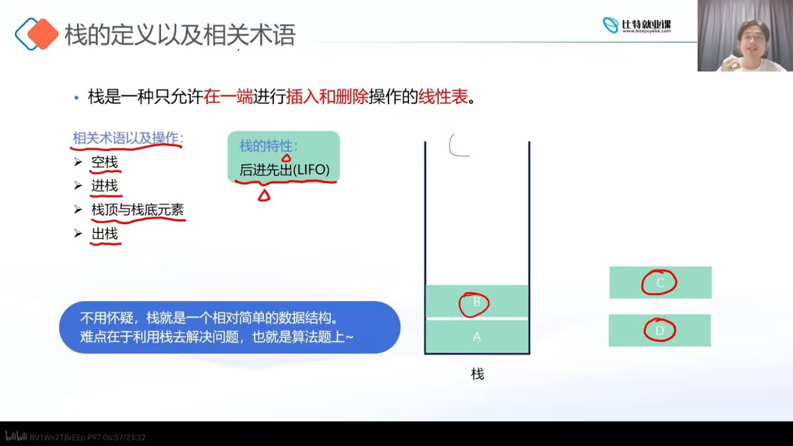
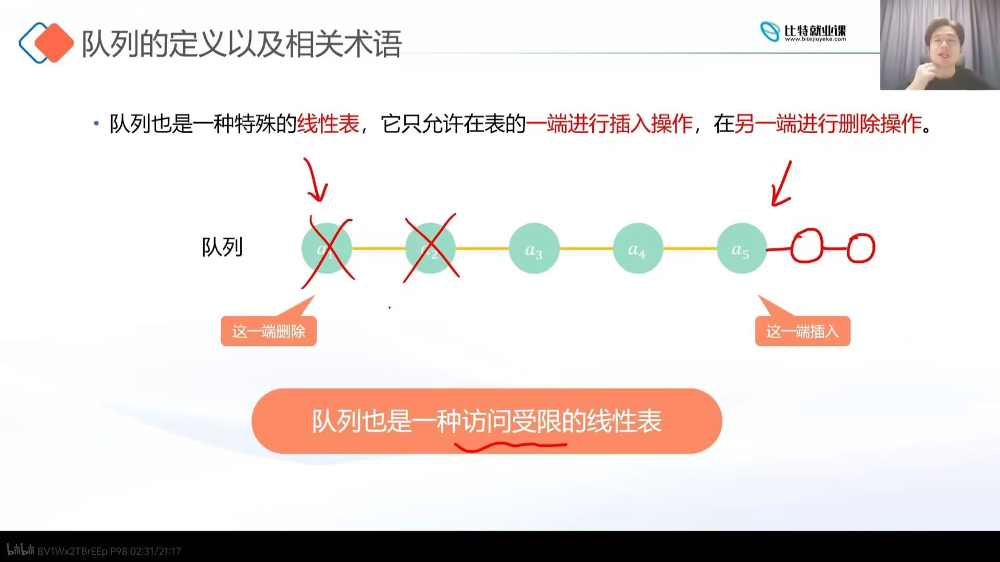
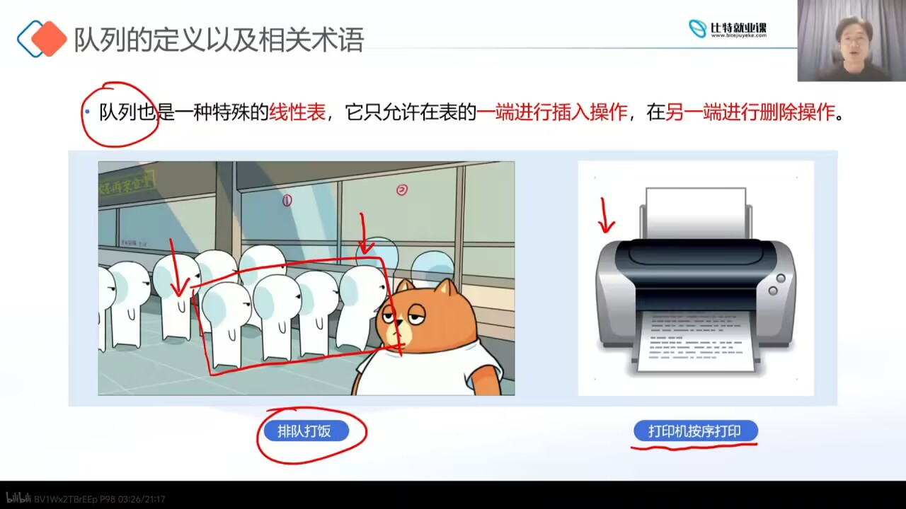
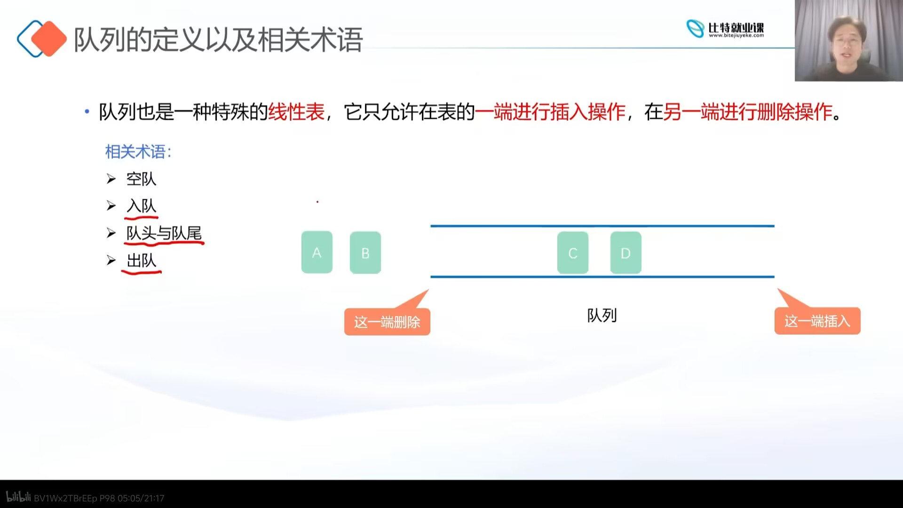
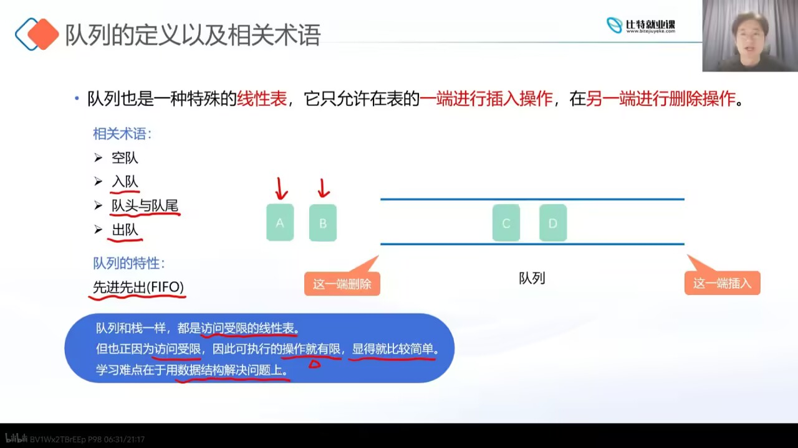
### 树

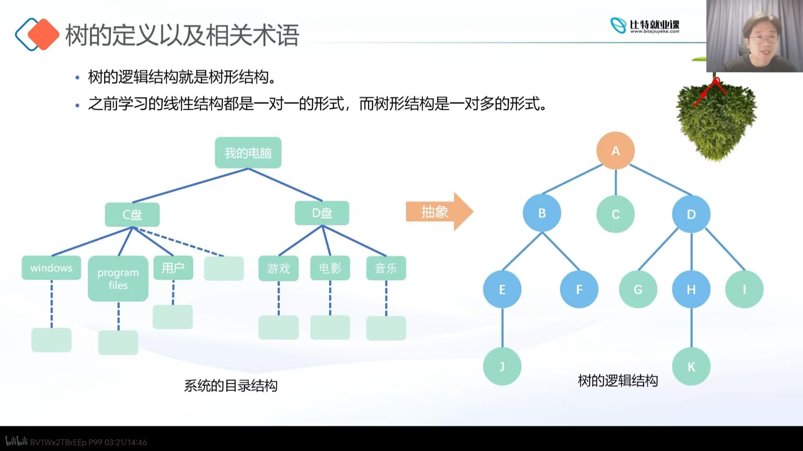
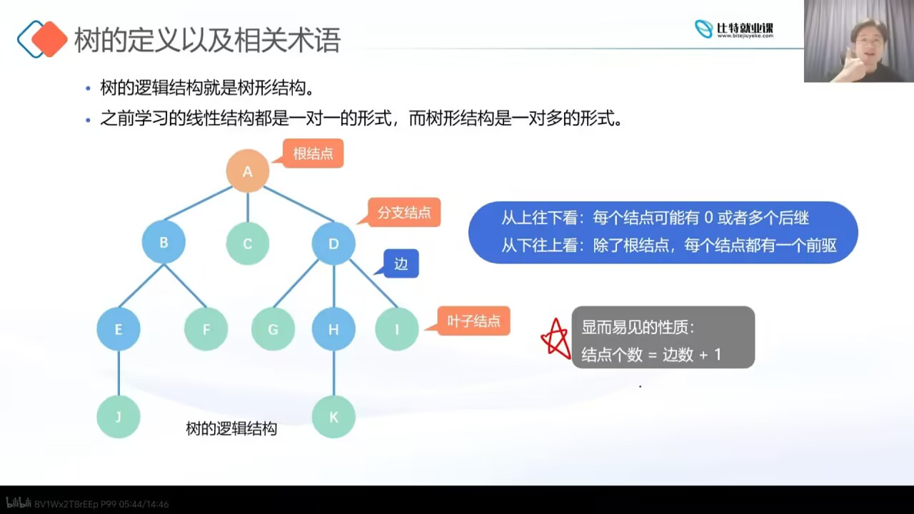
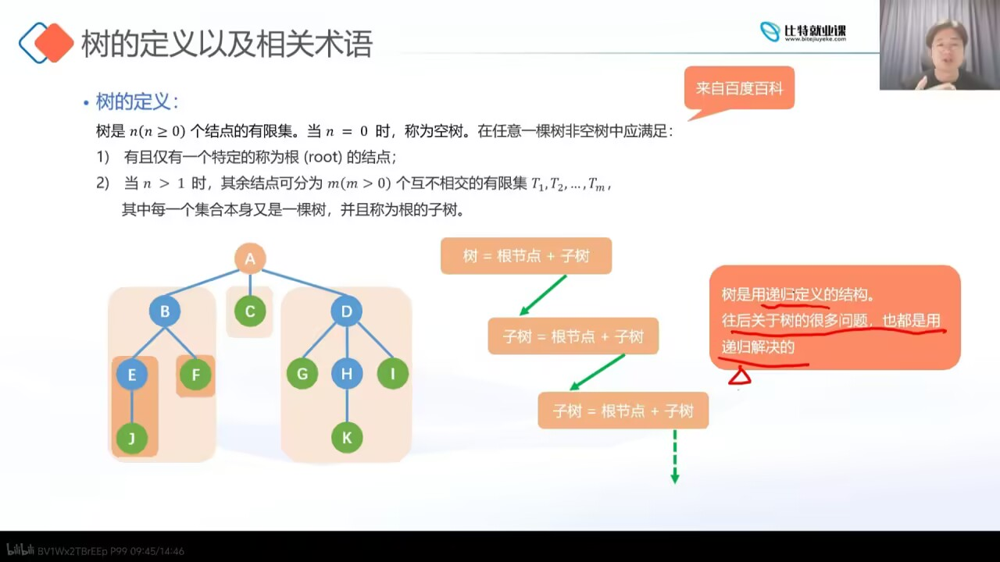
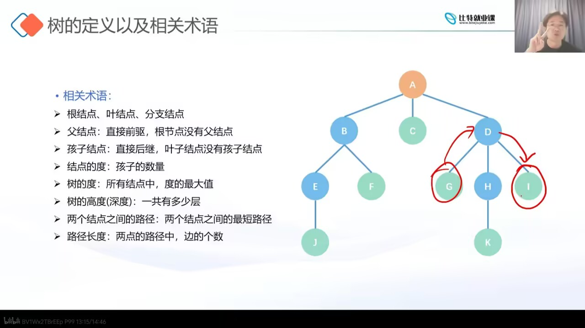
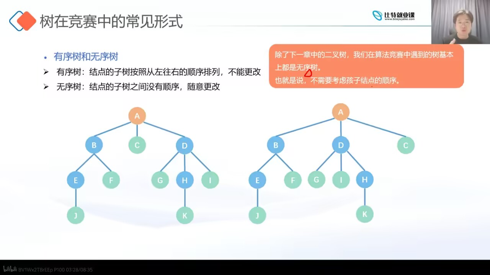
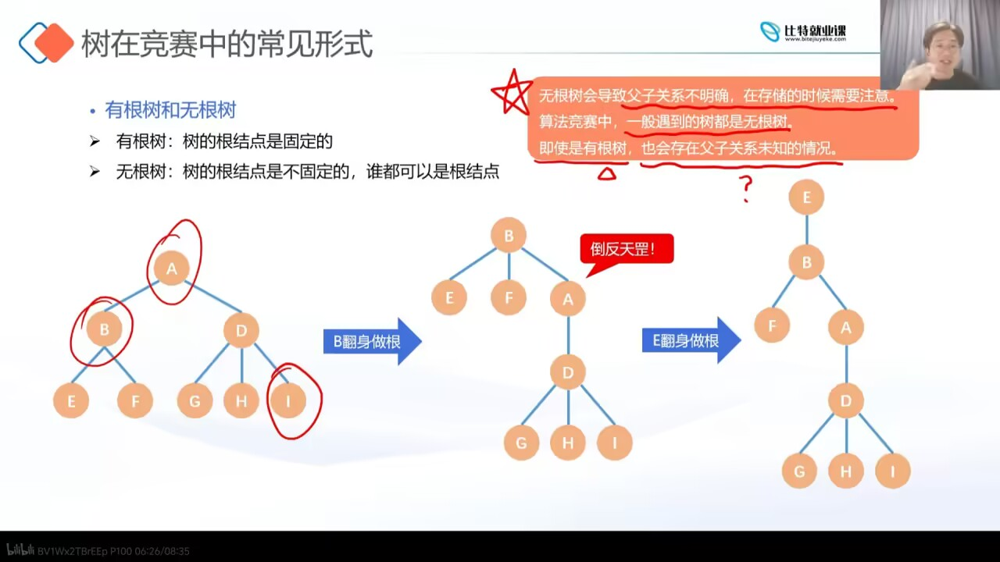
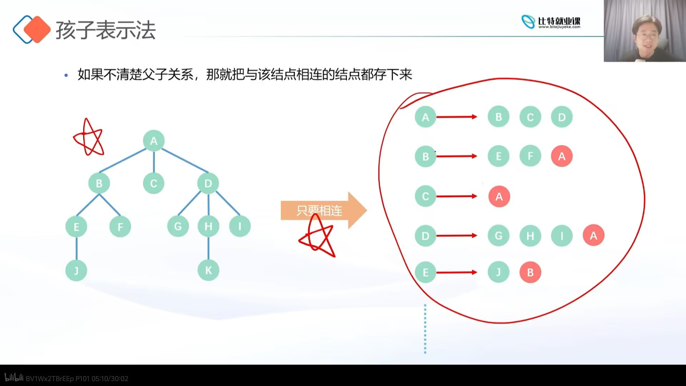

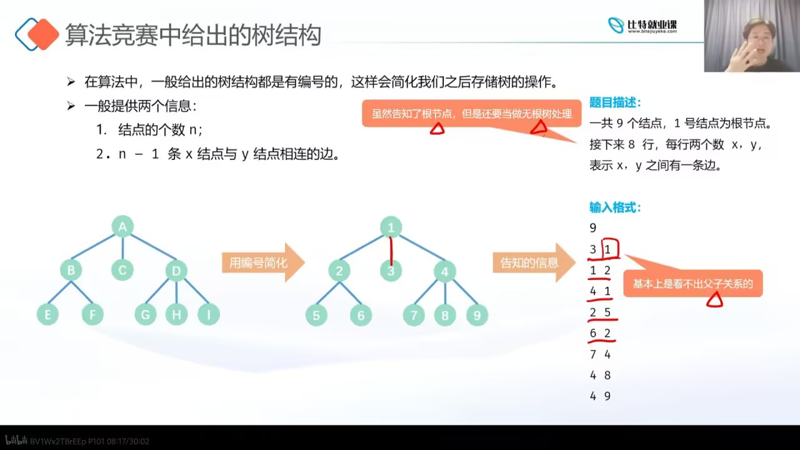
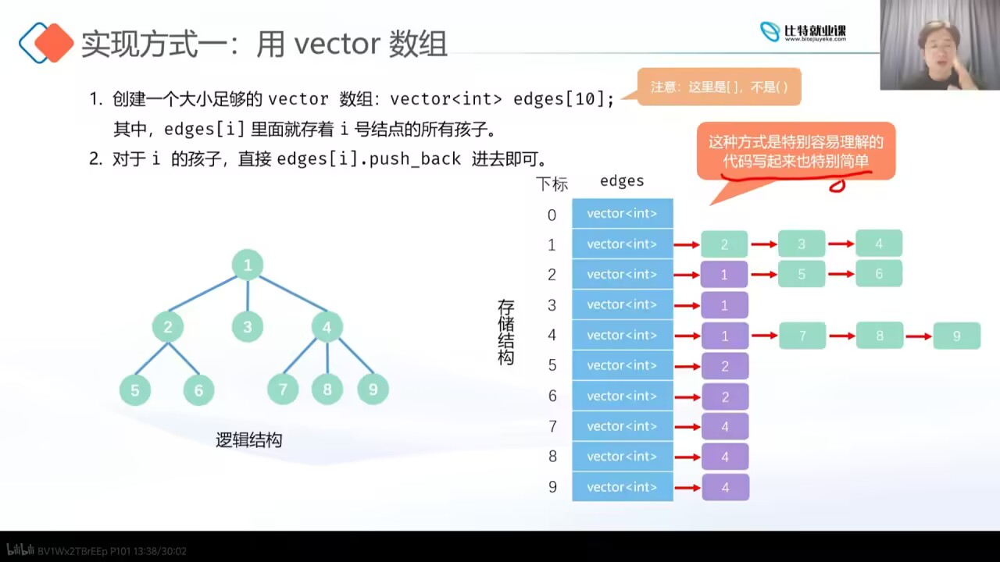
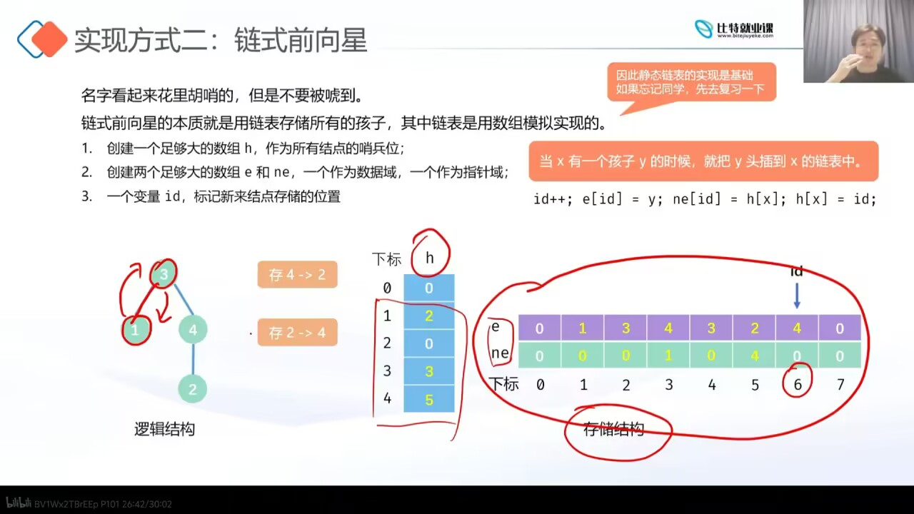


### 二叉搜索树


、、、


#### 迷宫 dfs 与 bfs


#### 树的存储
在算法竞赛和实际开发中，向量邻接表（`vector` 邻接表）是使用频率最高、最全能的建图与存树方式，没有之一。它完美地将“动态数组”的灵活性与“图论中按节点访问邻居”的物理直觉结合在一起。

今天我们就彻底把向量邻接表剥开，讲透它的**物理结构、内存真相、有权图的变形**以及**赛场上的核心遍历代码**。

 **一、 物理现场：向量邻接表到底长啥样？**

我们常写的声明是：

C++

```
vector<int> G[100005];
```

注意这个长相，它不是一个单纯的 `vector`，它是**一个装满了 `vector` 的普通一维数组**。

- 外部的大数组，下标 `i` 代表**当前的节点编号**。
  
- 内部的每个 `vector`，是这个节点**专属的邻居名单/儿子列表**。
  

**模拟建树现场**

假设有一棵树，1 号节点有三个孩子：2、3、4。在代码里执行：

C++

```
G[1].push_back(2);
G[1].push_back(3);
G[1].push_back(4);
```

此时在计算机内存里的连结关系就长这样：

**基础通关：无权图/树的存储与遍历**

如果树的边上**没有权重**（纯连通关系），我们直接用上面的基础写法。

 1. 赛场无脑双向建边模板

正如之前提到的，由于输入的两个数字谁是爹谁是儿不确定，我们直接把它当成“无向图”双向存储：

C++

```
#include <iostream>
#include <vector>

using namespace std;

const int N = 100005;
vector<int> G[N]; // 核心：邻接表

// 💡 加边函数
void add_edge(int u, int v) {
    G[u].push_back(v); // u 的邻居名单里加上 v
    G[v].push_back(u); // v 的邻居名单里加上 u
}
```

2. 标准树形 DFS 遍历（传爹拦截法）

双向建边后，遍历树最怕的就是“儿子又搜回亲爹”导致死循环。我们在 DFS 里加入一个 `father` 参数即可完美解决：

C++

```
// u: 当前访问的节点, fa: 带 u 进来的亲爹节点
void dfs(int u, int fa) {
    cout << "访问了节点: " << u << "\n";
    
    // 💡 极简遍历：利用 C++ 的 auto 循环，一口气扫完 u 的所有连通邻居
    for (int v : G[u]) {
        if (v == fa) {
            continue; // 拦截：如果发现这个邻居是亲爹，直接跳过，绝不回头！
        }
        // 能走到这的，百分之百是亲儿子，放心大胆地向下轰炸
        dfs(v, u); 
    }
}
```

 **三、 高级进阶：当边带上了“权重”（带权树/有权图）**

算法竞赛里大部分题的边都是带权重的（比如：从节点 $u$ 走到节点 $v$ 距离是 $w$）。这时候怎么用 `vector` 邻接表存呢？

这时就要请出我们的老朋友——**结构体 `struct` **。我们把邻居的“编号”和到邻居的“边权”打包在一起！

 **结构体邻接表满分模板**

C++

```c
#include <iostream>
#include <vector>

using namespace std;

// 💡 1. 声明带权边结构体
struct Edge {
    int to;       // 邻居的节点编号
    int weight;   // 边权（距离、花费等）
};

// 💡 2. 此时 G[i] 里面装的就是一个个 Edge 结构体了
const int N = 100005;
vector<Edge> G[N];

// 💡 3. 带权加边
void add_edge_with_weight(int u, int v, int w) {
    G[u].push_back({v, w}); // C++11 快捷初始化大括号写法
    G[v].push_back({u, w}); // 双向建边
}

// 💡 4. 带权树的 DFS 遍历
void dfs_with_weight(int u, int fa, int dist_from_root) {
    cout << "节点 " << u << " 到根节点的总距离是: " << dist_from_root << "\n";

    // 遍历结构体邻居
    for (int i = 0; i < G[u].size(); i++) {
        int v = G[u][i].to;       // 掏出邻居编号
        int w = G[u][i].weight;   // 掏出边权
        
        if (v == fa) continue;    // 传爹拦截
        
        // 向下递归，累加距离
        dfs_with_weight(v, u, dist_from_root + w);
    }
}
```

 四、 深度起底：向量邻接表为什么能成为“赛场统治者”？

很多硬核选手会质疑：`vector` 在后台满了不是会触发“翻倍扩容、搬家”吗？那频繁 `push_back` 难道不会拖慢速度吗？

1. **总时间复杂度依然是 $O(N + M)$ **：
   
    因为 `vector` 的扩容是**均摊 $O(1)$ ** 的。整棵树一共只有 $N-1$ 条边，所有的 `vector` 就算加起来，总共也只执行了 $2N$ 次 `push_back`。这点搬家开销在连续的物理内存加速面前，根本不值一提。
    
2. **硬件缓存（Cache）命中率极高**：
   
    当程序在跑 `for (int v : G[u])` 的时候，由于 `G[u]` 内部的邻居在内存里是**绝对连续**的，CPU 一把就能把它们全部抓进高速缓存里。这使得它的实际运行速度往往把到处乱飞的指针链表按在地上摩擦。
    
3. **支持极速清空（多组数据无敌）**：
   
    很多题目会给你多组输入（`while(cin >> n)`），每次开始前图都要清空。如果是指针链表，你得老老实实写个递归去 `delete` 释放内存，极易超时；而用 `vector` 邻接表，只需要：
    
    C++
    
    ```
    for(int i = 1; i <= n; i++) G[i].clear();
    ```
    
    一秒钟直接把计数器归零，原地的内存空间还可以留给下一组数据重复使用，干净利落！
    

既然你已经把向量邻接表（`vector`）和结构体玩得这么溜了，那今天咱们就来揭开图论和树形结构里**金字塔尖的顶级大招——链式前向星**。

在算法竞赛里，当数据量暴增到 $5 \times 10^5$ 甚至 $10^6$ 时，或者当题目设置了极度恶劣的 **128 MB 内存限制** 时，`vector` 邻接表会因为底层频繁扩容带来的“内存碎片”和微小的指针开销，面临“超时（TLE）”或“爆内存（MLE）”的绝境。

而链式前向星，就是为了**压榨极致速度、零内存浪费**而生的“终极武器”。

```
```C++
#include <iostream>
using namespace std;

const int N = 100005;
const int M = 200005;

struct Edge {
    int to;
    int next; 
} edges[M];

int head[N];     // 💡 全局变量默认初始化全为 0！
int edge_id = 1; // 💡 从 1 开始计数！

void add_edge(int u, int v) {
    edges[edge_id].to = v;
    edges[edge_id].next = head[u]; // 新边接老边
    head[u] = edge_id;             // head 更新为新边
    edge_id++;                     // 计数器递增
}

void dfs(int u, int fa) {
    // 💡 循环条件变成了 i != 0
    for (int i = head[u]; i != 0; i = edges[i].next) {
        int v = edges[i].to;
        if (v == fa) continue; // 拦截亲爹
        
        cout << u << " -> " << v << "\n";
        dfs(v, u);
    }
}

int main() {
    // 多组数据清空时，也变简单了：
    // for(int i = 1; i <= n; i++) head[i] = 0;
    // edge_cnt = 1;
    
    add_edge(1, 2);
    add_edge(1, 3);
    add_edge(4, 5);
    
    dfs(1, 0);
    return 0;
}
```


 **终极对决：链式前向星 VS `vector` 邻接表**

为什么说链式前向星是“卡常之王”？

1. **内存零浪费，绝对死卡上限**：`vector` 的扩容会多申请很多未使用的格子（比如你存 5 个数，它可能开辟了 8 个格子的空间）。而链式前向星的所有数据都死死卡在 `edges[M]` 里面，哪怕开到几百万条边，内存占用也是在编译期就固定死的一根直线，绝对不给评测机半点卡 MLE 的机会。
   
2. **速度极其凶残**：它彻底消灭了动态内存申请，全是一维数组的直接读写和下标位移，这在计算机底层被翻译成了极速的汇编指令，运行速度比 `vector` 快了接近 3 倍。
   
3. **多组数据清空极快**：如果题目有多组输入，`vector` 邻接表需要对每个节点的 `vector` 都执行一次 `.clear()`。而链式前向星只需要：
   
    C++
    
    ```
    memset(head, -1, sizeof(int) * (n + 1));
    edge_cnt = 0;
    ```
    
    只需一句话，哪怕图有 100 万个节点，也能在 0.001 秒内把整张图瞬间重置，堪称多组测试数据题目的必杀技。
    

### 堆与优先队列
https://blog.csdn.net/xiaomucgwlmx/article/details/103522410
在算法和数据结构里，**堆（Heap）** 是一个经常被误解的概念。很多人听到“堆”，第一反应是操作系统内存分配里的那个“堆区（Heap）”——但那是两码事。

我们要讲的堆，是一种**特殊的、极度擅长“挑最值”的二叉树数据结构**。

我们可以把堆比作一个**严格的“职场晋升沙盘”**。在这个沙盘里，只有两种模式：要么是能力越强（数字越大）越在顶层，要么是年龄越小（数字越小）越在顶层。

 **一、 堆的核心人设：职场晋升的两条铁律**

在物理特性上，堆必须是一棵**完全二叉树**（树的格子从上到下、从左到右必须紧凑填满，绝对不能跳着空格子）。

根据顶层规则的不同，堆分为两种：

1. **大根堆（Max Heap）：能者上，庸者下**

- **铁律**：每一个上司节点（父节点）的数值，都**必须大于或等于**它的下属节点（子节点）。
  
- **结果**：全公司能力最强（数值最大）的那个“老总”，永远稳稳地坐在**整棵树的根节点（最顶端）**。
  

2. **小根堆（Min Heap）：资历年轻的上，年老的下**

- **铁律**：每一个上司节点的数值，都**必须小于或等于**它的下属节点。
  
- **结果**：数值最小的那个元素，永远坐在**最顶端**。
  

 **二、 堆的精妙底层：明明是一棵树，却偷偷躺在数组里**

这是堆最让人拍案叫绝的地方：它在逻辑上是一棵分层的二叉树，但在物理内存里，它**根本不需要任何结构体指针**，只用一个简简单单的 **一维数组** 就能存下整棵树！

因为完全二叉树的节点分布极其规律，如果我们把下标**从 1 开始计数**，你会发现一个惊人的常识数学规律：

> 对于任意一个在数组下标为 $i$ 的节点：
> 
> - 它的 **左孩子** 必定躺在：$2 \times i$ 的位置。
>     
> - 它的 **右孩子** 必定躺在：$2 \times i + 1$ 的位置。
>     
> - 它的 **亲生父亲** 必定躺在：$i / 2$ （向下取整）的位置。
>     

你看，根本不需要 `left` 和 `right` 指针，通过下标乘除法，计算机就能瞬间在堆里完成“向上找爹”或“向下找儿子”的动作！

 **堆的生存法则：它是怎么自我修复的？**

堆之所以厉害，是因为当有新员工入职（插入元素），或者老总离职（删除堆顶）时，它能以恐怖的 $O(\log N)$ 速度瞬间重组职场秩序。

**动作一：向上调整（Up / Shift Up）—— 新人逆袭**

当一个新元素加入堆时，它会被暂时安插在数组的最末尾（树的最后一个空位）。如果它的能力太强（比如在大根堆里，它的值比它父亲还大），它就会触发**逆袭机制**：

> **大白话流程**：和亲爹比大小。如果我比我爹大，我就把爹踹下去，我自己坐到爹的位置上；然后继续和新爹比，直到发现打不过新爹，或者自己已经当上总负责人（爬到根节点）为止。

**动作二：向下调整（Down / Shift Down）—— 继承人选拔**

当我们想要获取整个堆的最值时，我们只能拿走**堆顶（也就是 `heap[1]`）**。老总一走，群龙无首，位置空出来了怎么办？

1. 堆会冷酷地把**数组最后面的那张“嫩面孔”（最后一个元素）** 强行揪过来，拍在堆顶 `heap[1]` 的椅子上。
   
2. 这个新人大概率挑不起大梁，于是触发**降职调整机制**：
   

> **大白话流程**：坐在堆顶的新人，冷眼看着自己的左、右两个儿子，挑出**能力最强的那个大儿子**。如果大儿子比自己强，新人就叹口气和它交换位置（降职）；降下去之后，继续看着新一层的两个儿子挑最强的比，直到自己站稳脚跟。

 **🌟 赛场神兵利器：优先队列 `priority_queue`**

在算法竞赛或者实际开发中，除非面试官指名道姓让你手写，否则**绝对不要手写上面的数组搬家逻辑**！

C++ 标准库里已经为你封装好了最完美的堆实现，它的名字叫 **优先队列（`priority_queue`）**。

**竞赛无脑调库模板：**

C++

```
#include <iostream>
#include <queue> // 💡 堆的官方大本营

using namespace std;

int main() {
    // 💡 默写标准 1：默认声明出来的是【大根堆】（高分/大值先出）
    priority_queue<int> max_heap;

    max_heap.push(10);
    max_heap.push(30);
    max_heap.push(20);

    cout << "大根堆弹出的老总是: " << max_heap.top() << "\n"; // 输出 30
    max_heap.pop(); // 弹出 30
    cout << "大根堆现在的二把手是: " << max_heap.top() << "\n"; // 输出 20

    cout << "---------------------\n";

    // 💡 默写标准 2：极其绕口的【小根堆】声明方式（小值/低分先出）
    // 三个参数：元素类型、底层容器、比较器
    priority_queue<int, vector<int>, greater<int>> min_heap;

    min_heap.push(50);
    min_heap.push(10);
    min_heap.push(30);

    cout << "小根堆弹出的最年轻的是: " << min_heap.top() << "\n"; // 输出 10
    
    return 0;
}
```
它最擅长解决什么问题？

- **动态求中位数/第 K 大的数**：数据在源源不断地进来，你却想在任何瞬间都知道排在第 K 名的人是谁（Top-K 问题）。
  
- **迪杰斯特拉（Dijkstra）最短路算法优化**：在图论中，每次需要从大本营里挑选出“当前距离最近的那个城市”，用小根堆可以将寻找的时间复杂度从暴力的 $O(N)$ 降到惊人的 $O(1)$。
  

堆这种结构，把树的宏观逻辑和数组的微观下标完美扣在了一起，用最简单的数组干最漂亮的挑最值工作。这个“职场晋升和自我修复”的物理画面，现在在你脑海里顺过来了吗？

### 哈希表与 underedmap
在所有的数据结构里，**哈希表（Hash Table，也叫散列表）** 是绝对的“外挂”般的存在。

普通数组想找一个数字，得从头到尾挨个瞅一遍（时间复杂度 $O(N)$）；即使是排好序的数组，用二分查找也得折腾几下（$O(\log N)$）。而哈希表最恐怖的地方在于：**无论你存了 10 个数还是 100 万个数，它都能在“一瞬间”（时间复杂度 $O(1)$）直接揪出你要找的数据！**

它是怎么做到的？我们可以把哈希表比作现实生活中的“寄包处”。

 **哈希表的核心戏法：特工暗号（哈希函数）**

假设你去超市寄包，你不能随便把包乱扔。超市会给你一个**暗号（小票上的条形码）**，条形码对应着一个**固定的柜子编号**。

在计算机里，这个产生暗号的过程叫做 **哈希函数（Hash Function）**。

- **输入**：你想存进去的钥匙（Key），可以是一个很长的字符串、一个大整数，甚至是一张图片。
  
- **加工**：哈希函数对这个 Key 经过一通极其复杂的数学运算（比如疯狂乘一个素数再取模）。
  
- **输出**：吐出一个规规矩矩的数组下标（槽位 Index）。
  

> **大白话现场**：
> 
> 你对哈希表说：“我想把 `张三` 的手机号存进去。”
> 
> 哈希函数一算：`张三` $\rightarrow$ 经过计算得到数字 `5`。
> 
> 计算机一秒都不耽误，直接把张三的手机号塞进 **数组第 5 号格子**。
> 
> 下次你想查张三，哈希函数再次对 `张三` 算一下，依然得到 `5`，直接去 5 号格子拿。不用遍历，一步到位！

 **物理车祸：当两个人算出了同一个暗号（哈希冲突）**

世界上最尴尬的事情发生了：你想存 `张三`，哈希函数算出是 `5`；此时又来了一个人叫 `李四`，哈希函数一算，**结果居然也是 `5` **！

这就叫 **哈希冲突（Hash Collision）**。一个位置只能坐一个人，5 号格子撞车了！为了解决这场车祸，主流一共有两大门派：

**门派 1：拉链法（Chaining）—— 顺藤摸瓜挂灯笼**

既然 5 号格子只能装一个，那我们就把 5 号格子改成一根**挂钩**。

- 张三先来，挂在 5 号格子的第一环。
  
- 李四也算到了 5 号，没关系，让他像拉链一样，紧紧**吊在张三的屁股后面**。
  
- **查找时的操作**：当你要找李四，先空降到 5 号格子，顺着张三往后摸，就能一下抓到李四。
  

**门派 2：开放寻址法（Addressing）—— 占座法**

这种方法非常简单粗暴：不搞小团体拉链，整个大数组谁都可以坐。

- 李四算出来是 5 号，一看，完蛋，张三已经把位置占了。
  
- 李四不哭，开始往后瞅：6 号空着吗？没空继续瞅 7 号……直到找到第一个空格子，一屁股坐下。
  

 **🌟 赛场绝对主力：标准库的两大哈希神器**

在算法竞赛（如洛谷、力扣、Codeforces）中，除非题目变态到让你手写哈希函数，否则**千万别手写拉链和占座法**！C++ 官方提供了两个基于哈希表实现的超级容器，它们躺在 `<unordered_map>` 和 `<unordered_set>` 里。

> ⚠️ **注意分辨**：名字里带 `unordered`（无序）的才是纯正的哈希表（$O(1)$）；如果不带 `unordered`（比如 `std::map`），它的底层是红黑树（平衡二叉树），查找速度是 $O(\log N)$。比赛里如果不需要排序，**无脑首选无序版本**！

**`unordered_set`（无序集合）：主要用来“查重”**

它里面只存 Key（键），用来快速判断某个东西之前有没有出现过。

C++

```
#include <iostream>
#include <unordered_set> // 💡 引入无序集合

using namespace std;

int main() {
    unordered_set<int> visited;

    // 疯狂塞入数字
    visited.insert(10);
    visited.insert(20);
    visited.insert(10); // 重复塞入，哈希表会自动去重

    // 💡 核心大招：在 O(1) 时间内判断 20 在不在
    if (visited.count(20)) {
        cout << "20 之前来过！\n";
    }

    // 也可以用 find() 查找
    if (visited.find(99) == visited.end()) {
        cout << "99 绝对是个陌生人。\n";
    }
    return 0;
}
```

2. **`unordered_map`（无序映射）：KV 账本，最常用！**

它存的是一对对的 `(Key, Value)`。你给它一个钥匙，它给你对应的值。

C++

```
#include <iostream>
#include <unordered_map> // 💡 引入无序映射
#include <string>

using namespace std;

int main() {
    // 账本：人名(string) -> 成绩(int)
    unordered_map<string, int> score_board;

    // 💡 像用普通数组一样，直接用中括号极其优雅地存数据！
    score_board["张三"] = 95;
    score_board["李四"] = 100;
    score_board["王五"] = 59;

    // 💡 同样以 O(1) 的超能力瞬间查出分数
    cout << "李四的分数是: " << score_board["李四"] << "\n"; // 输出 100

    // 💡 避坑指南：如果查一个不存在的人，它会自动把这个人创建出来并赋默认值 0！
    // 为了安全，查之前最好先用 count 判断一下
    if (score_board.count("赵六")) {
        cout << "赵六的分数是: " << score_board["赵六"] << "\n";
    } else {
        cout << "账本里查无此人！\n";
    }
    return 0;
}
```

### 排序
#### 插入排序

#### 选择排序

#### 冒泡排序

#### 堆排序


#### 快速排序


#### 归并排序
## 算法基础
### 模拟
### 高精度


### 枚举


### 前缀和与差分


### 双指针


### 二分查找与二分答案


### 贪心


### 倍增思想
### 递归思想


### 分治思想


### 搜索


### 单调栈与单调队列


### 字符串哈希

### trie 字典树

### 动态规划
动态规划的思想：

> **不要一次解决整个问题，把它拆成前缀问题**


 思考落脚点 1：把“大问题”降维成“眼前这个数”

面对一串长长的序列，不要一上来就想着整个序列。**把注意力拉回到当前的第 $i$ 个数 $A_i$ **：

> **“我现在站在第 $i$ 个数面前，我能不能把我这个数 $A_i$，接在前面已经排好的某个上升子序列后面？”**

要接上去，必须满足唯一条件：**前面的那个子序列的“末尾数”必须比我小！**

所以，你立刻意识到：

1. 我必须知道**前面每个子序列的末尾是谁**。
   
2. 我必须知道**以前面某个数结尾时，最长能有多长**。
   


![[算法上课ppt.assets/d3ffa1c761c9690ebc53452a9b4663f6_MD5.jpg]]


交互动态网页：
01 背包二维：https://qymslf1p.html2web.com
01 背包一维：https://7naj1cip.html2web.com

先拿基础题统一举例：

> 爬楼梯：一次走 1 或 2 阶，走到第 n 阶有多少种走法？
> 
> 公式：\(f(n) = f(n-1)+f(n-2)\)，边界\(f(1)=1,f(2)=2\)

**一、重叠子问题（DP 为什么能省时间：重复计算太多**）

 **定义**

求解大问题时，会**反复计算完全一样的小子问题**，大量重复运算，暴力递归会爆炸。

 **爬楼梯例子**

求\(f(5)\)：

\(f(5)=f(4)+f(3)\)

\(f(4)=f(3)+f(2)\)

\(f(3)=f(2)+f(1)\)

这里\(f(3)\)被算了 2 次、\(f(2)\)被算了 3 次，这就是**重叠子问题**。

纯递归不优化：时间复杂度 \(O(2^n)\)，n=40 就会卡慢。

对比无重叠（分治，比如归并排序）

归并排序拆分的子区间互不重复，没有重叠子问题，所以不用 DP。

**二、最优子结构（DP 能递推的前提：大事最优由小事最优推出）**

**定义**

一个**全局最优解**，可以由它若干**子问题的最优解**直接组合得到。

没有这个性质，DP 完全不成立。

**爬楼梯例子**

要走到 5 阶的全部走法，最优 / 全部方案，一定是：

走到 4 阶的所有走法末尾 + 1 步 + 走到 3 阶的所有走法末尾 + 2 步

大问题的解 = 两个子问题最优解相加。

**反例（不满足最优子结构，不能 DP）**

比如迷宫：从起点到终点最短路径，中间如果有传送门绕路，局部最短拼不出全局最短，不满足最优子结构，无法 DP。

**三、无后效性（DP 递推的安全保障：过去不被未来影响**）

 **定义**

1. 划分状态后，**当前状态的值只依赖前面已经算完的状态**；
2. 未来的决策、后面的状态，**不会反过来改变当前状态的结果**；
3. 只要算完第 i 层，后面 i+1、i+2 怎么变，都不会影响 i 层的答案。

 **爬楼梯例子**

状态\(f[i]\)：到第 i 阶的走法数量

算\(f[5]\)只依赖\(f[4],f[3]\)；

就算后面算\(f[6],f[7]\)，\(f[5]\)的值永远不会变，完全不受后续操作干扰 → 无后效性。

 **反例（有后效性，不能简单 DP）**

带状态反悔的题目：选物品后可以丢弃，后面的操作会修改前面已经计算的状态，存在后效性，不能标准一维 DP。

**四、记忆化搜索（递归版 DP，解决重叠子问题）**

 **作用**

开数组 / 哈希表**存已经算过的子问题答案**，下次再遇到直接查表，不再重复递归计算，消除重叠子问题。

 **爬楼梯记忆化代码示意**

cpp

运行

```
int memo[1005]; // 备忘录，记录算过的值
int dfs(int n){
    if(n==1) return 1;
    if(n==2) return 2;
    if(memo[n] != 0) return memo[n]; // 算过直接返回，不重复递归
    memo[n] = dfs(n-1)+dfs(n-2);
    return memo[n];
}
```

- 暴力递归：\(O(2^n)\)
- 记忆化搜索：\(O(n)\)，每个子问题只算 1 次

 **特点**

自上而下（从大问题拆小问题），代码接近暴力递归，不用手动规划循环顺序。

**五、空间换时间（DP 通用优化思想）**

**定义**

多开辟一块内存（数组、备忘录、dp 表）存储中间子问题结果，**牺牲存储空间，大幅降低时间复杂度**。

1. 记忆化搜索的 memo 数组：空间换时间
2. 迭代 DP 的 dp [] 数组：空间换时间

 **爬楼梯对比**

- 纯递归：几乎不占额外空间，但时间爆炸；
- 记忆化 / 迭代 DP：开数组占 O (n) 空间，时间直接压到 O (n)。

**拓展优化（滚动数组）**

部分 DP 可以再压缩空间：比如爬楼梯只需要前两项，不用存整个数组，把 O (n) 空间压到 O (1)，属于**时间不变，优化空间**。

 整合总结五者逻辑链条（做题判断 DP 的完整流程）

1. 先看问题是否有**最优子结构**：大最优能拆成小最优 → 有做 DP 的基础；
2. 再看是否有**重叠子问题**：子问题重复计算 → 需要优化；
3. 再看是否**无后效性**：状态之间单向依赖，互不回改 → 可以安全递推；
4. 解决重叠子问题两种手段：
   
    - 自上而下：**记忆化搜索**（开备忘录数组）
    - 自下而上：迭代 DP 填表
    
5. 以上两种方式本质都是**空间换时间**，用存储消除重复计算。

极简口诀

最优拆小事，重复重叠题；

状态不回头，名叫无后效；

开表存答案，空间换时间；

递归存结果，记忆化搜索。
#### 经典路径问题


#### 背包问题


[](算法上课ppt.assets/fe1c25da23c157ca7f971de3f066fe6f_MD5.jpg)
![[算法上课ppt.assets/fe1c25da23c157ca7f971de3f066fe6f_MD5.jpg]]

![[算法上课ppt.assets/6c63b5d0084f9947b9b7561cb1bd9557_MD5.jpg]]

![[算法上课ppt.assets/cb7552ce73c1dc0ad2503f70b625af95_MD5.jpg]]
![[算法上课ppt.assets/e9707ed8e78130dc18787bb596aa6128_MD5.jpg]]
![[78a4db34a192f54182ee32a8e92eb450_MD5.jpg]]


## 图论


### 最小生成树


### 拓扑排序


